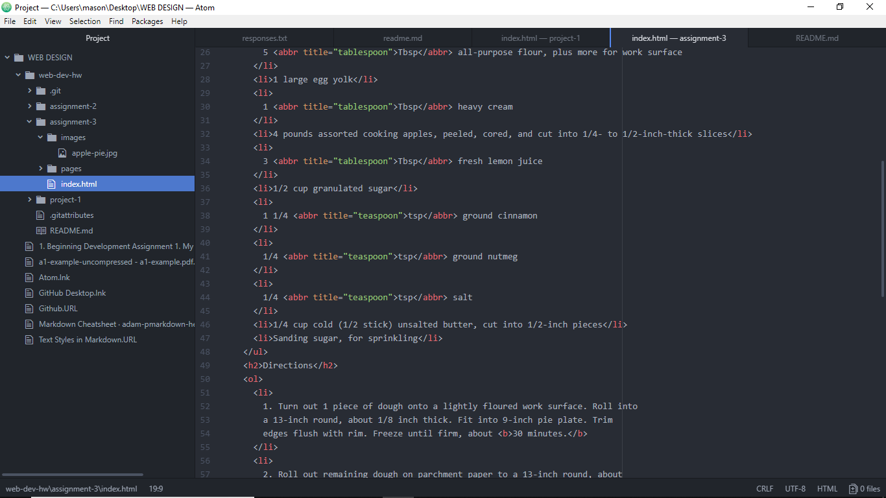

# Assignment 3

A webpage should have one head and one body, just like a human being. 
What's in the body will be part of the main part of the webpage, but just like in a human being, what's in the head won't show 
although it can change what's in the body.

Semantic markup is about what the pieces mean and structural markup is about how they look on the page.

When I was following the page instructions, I got confused by "nested lists" at first because I thought they were
a third kind of list with different tags and tried to google them for a while before I figured it out. This was the
assignment where I learned that pressing enter inside the html file wouldn't hurt anything, which is good because those lines were getting really long.
I was surprised when I tested this page to see that I forgot that the html lists add in the numbers and bullet points themselves. 
I feel like I know that now. I also saw I forgot to put breaks a couple of places and it looked really bad.

