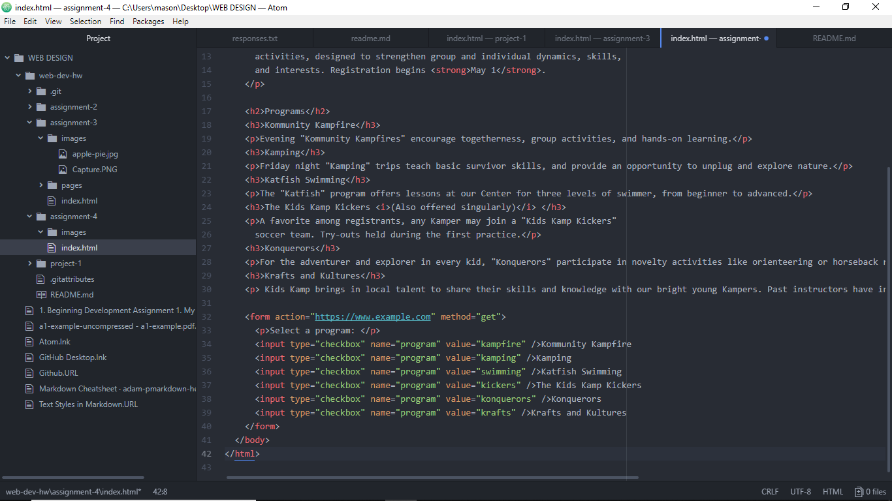

# Assignment 4

Alt text is text that gets attached to an amage on the internet describing it. It helps make websites more understandable for 
people with visual impairments who can't see the images.

I see a lot of different forms on the internet-- all have 
blanks for information and buttons for submitting it, and if you leave something important out, you'll get a message saying so. 
They all look a lot alike, although they come in a huge range of lengths. They can be used for logging into websites, submitting posts
and comments, buying things online and applying for jobs.

The layout for tables can be really confusing. I had to use examples on paper again and even after that, I made one little mistake and the whole 
thing looked really bad. I had to count all the sections to figure out what went wrong. I had fun optimizing the picture to be exactly 1000 KB, 
since that was the maximum for optimized images, but it kept coming out as more than 1MB, so I redid it. I don't think I realized at first you had to add "name" to all the form elements but I luckily
saw it again when I was trying to find information about the figure element. I ended up googling it because I couldn't find it in our class 
materials. There was no option in the jerseys for people who weren't signing their kids up for soccer and didn't want one, so in real
life I suppose I would ask the client if they wanted me to add one.

