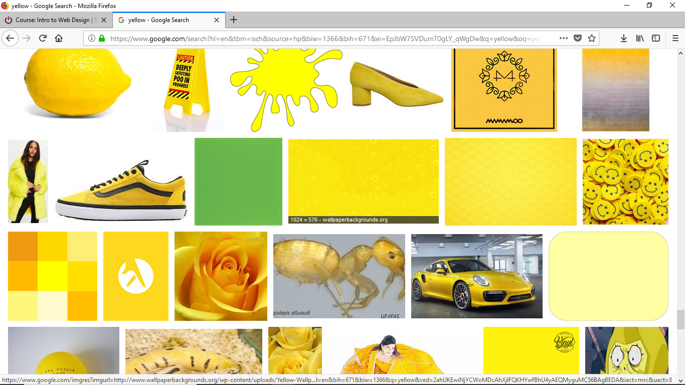

# Project 1

For browsers, I usually just use Firefox, Chrome sometimes on my phone. A browser is just a program that helps people use the Web 
without needing much technical knowledge.

For the Wayback machine, I visited cracked.com. That and other websites I looked at before 2000 were mostly images you couldn't see anymore.
I went to cracked.com from 2006 and noted that the page had much simpler formatting. Many of the links for content were broken and 
instead of current social media, one could click to add the site to "My AOL" or "My Yahoo". It looks a lot better in 2018. The layouts 
aren't so crowded.

I asked my partner to pick a poem of hers for me to use. It was shorter than I expected, but that's okay because I don't have much time. 
The picture is a hint. This was the first place I learned about relative linking and it took me a while to figure out the system at first. I had to write down 
some examples on paper. Now that I'm going back and typing in my readmes, though, I can tell I understand it now.

This screenshot of my work also has the solution:

